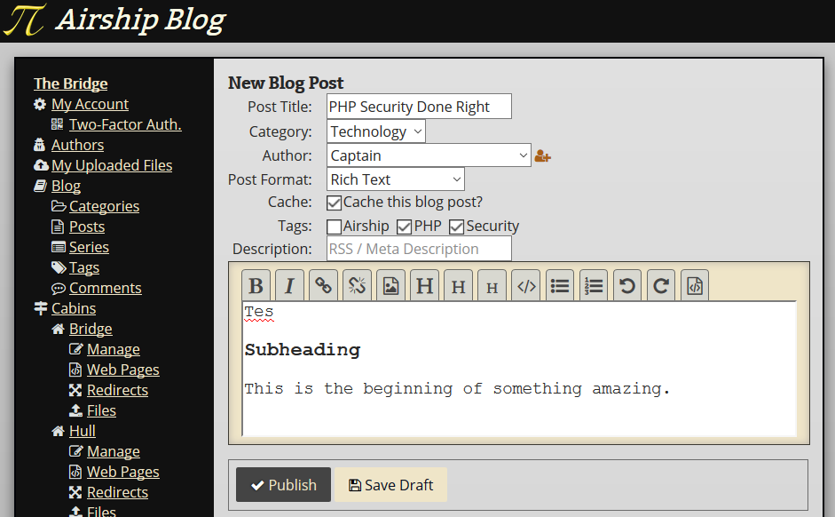

# Using the Blog Features

## Blog Posts

If you are logged into an account that has permission to create blog posts,
visiting `{bridge URL}/blog/post` should yield a "New Blog Post" button. If you
do not see this button, an administrator can grant you access by, for example,
adding you to the "Writer" group.

* Post Title: This will be the headline that your readers see.
* Category: What category does this blog post belong to?
* Author: Select an [Author](01-Crew.md) to attribute this blog post to.
* Post Format: Blog posts can be written in:
  * Markdown
  * ReStructuredText
  * Rich Text
  * Raw HTML
* Cache: If you check this box, your blog post will be cached as a static page.
  This is useful for if a blog post goes viral on Slashdot, Hacker News, etc.
* Tags: Check all the tags that apply to this blog post.
* Description: This goes in the Meta tags and is previewed in the RSS feed for
  the blog.

The large textbox is where the contents of your blog post goes.

If you have permission to publish blog posts, you will be see the Publish
button. Otherwise, you can only save a draft. Once a blog post is published,
it will be live on the front page.

## Categories

Categories are like folders on a computer. Folders can contain files or other
folders. Categories are the same way.

Each category has a name and a parent category. When you write a blog post and
assign it to a particular category, the blog section will diplay all posts in
that category and any categories underneath it.

For example:

* Photography
* Science
  * Chemisty
  * Physics
    * Nuclear Physics
* Technology

If you write a blog post in the Physics category, it will be listed when a user
browses for `Science` or `Physics` blog posts, but not `Nuclear Physics`.

Every blog post can belong to one category (or be uncategorized).

### Creating Categories

If you are logged into an account that has permission to create categories,
visiting `{bridge URL}/blog/category` should yield a "New Category"
button.

Give your new category a name and optionally select another category to file
it under.

In the box below, you can supply a preamble that shows up on the blog listing
for that specific category. It's a good way to provide a bit of insight into
what the reader can expect. Click "Preview" to quickly see what your changes
look like.

After you click "Create New Category", you can return and edit them at any
time.

## Series

A series is a freeform alternative to categories that gives you more control
over the structure of the collection. Series may contain other series or blog
posts, but you get to dictate the order.

Additionally, there will be "previous" and "next" links at the bottom of each
blog post. This makes series more ideal for structuring your content like a
book or series of books.

For example:

* **Book 1:** The Chronicles of Exampletown
  * Preface: A blog post
  * **Act 1:** Welcome to Exampletown
    * **Chapter 1**: Foo at the Bar
      * Page 1: A blog post
      * Page 2: Another blog post
    * **Chapter 2**: Bar Baz
      * Page 3: Yet another blog post
    * Interlude Blog Post
    * **Chapter 3**: The Example Intensifies
  * **Act 2:** Et Cetera
* **Book 2:** The Demonstration
* A Short Essay about a Minor Character
* **Book 3:** The "I Reckon"ing

Unlike categories, which are universal, series are owned by a particular
[Author](01-Crew.md).

### Creating a Series

If you are logged into an account that has permission to create series,
visiting `{bridge URL}/blog/series` should yield a "New Series" button.

Give your series a name and select which [Author](01-Crew.md) you want to have
ownership over the series.

Next, select the format you want to write the preamble in. When in doubt,
**Rich Text** is the easiest. Next, write a preamble that will be
displayed at the top of the series page. Feel free to customize the text for
the link labels as well.

Finally, add any blog posts (or other series) from the same Author that you
wish to include. You can change the order of the items in the series by
dragging and dropping them in the "Series Contents" box.

When you are done, click "Create Series".

## Tags

Blog posts can have any number of tags. They're exactly what most users expect
from a tagging system.

[Next: Account Settings](03-Account.md)
