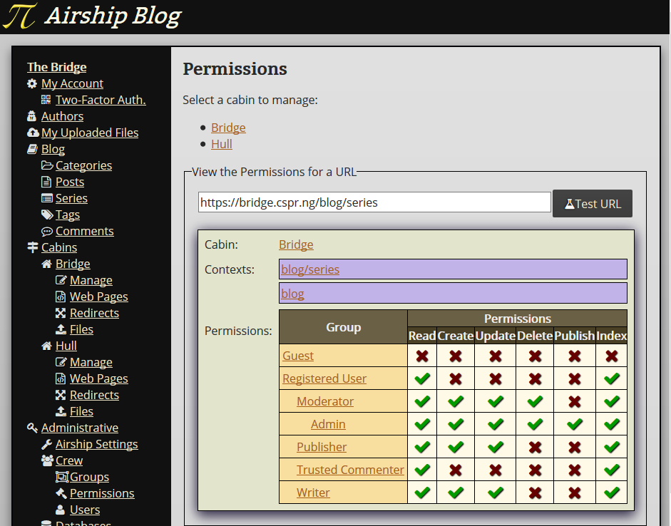
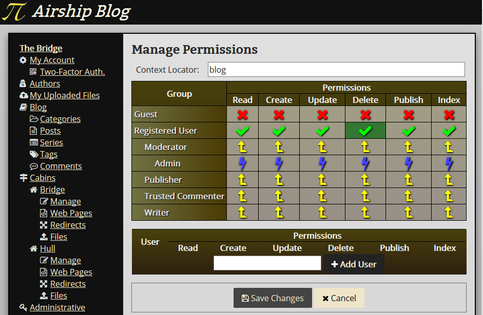

# Permissions

**Administrator Access Required**

Airship uses a white-list access controls system based on three concepts:

1. **Contexts**: Where are you in the application?
2. **Actions**: What are you trying to do?
3. **Rules**: Which users/groups are allowed to perform which actions in
   which contexts?

A particular permissions request can match many contexts, especially if
there are overlapping patterns. When this happens, every context is
validated and the permission request is only granted if they all
succeed. If there are no contexts matching a particular request, the
request is refused (unless the user is an admin).

Each Cabin has its own set of possible actions (e.g. 'create', 'read',
'update', and 'delete').

Rules grant a particular user or group the ability to perform a
particular action within a particular context. Rules can only be used to
allow access, not deny access. (That's what white-list means.)

If you set a rule to allow a group to perform an action within a given
context, then all of that group's descendants will also be allowed.

